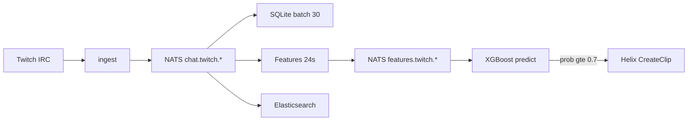

# Snipr

Automatic Twitch clipper for **esports matches**. Snipr watches live chat during a game,
scores short windows of hype with the same 8 features used in ValSparks, runs an XGBoost
model in Go, and creates a Helix clip when the model says the moment is worth saving.

Built for learning a Go + NATS message pipeline (ValSparks-style, but NATS instead of Kafka).

## Use case

During a VCT / CS / LoL / Valorant broadcast, chat spikes on clutches, aces, and throws.
Manual clipping misses half of those moments. Snipr:

1. Joins Twitch IRC for one or more match streams
2. Batches chat into **24-second** windows
3. Builds an 8-feature vector (volume, uniqueness, repeats, entropy, fuzzy hype words)
4. Runs XGBoost; if `P(hype) >= 0.7` and the channel is outside a **30s** cooldown, creates a clip

Operators can run it headless next to a production desk, or as a personal clip bot for ranked VODs.

## Architecture

```text
                    Twitch IRC (websocket)
                            |
                            v
                      ingest (Go)
                            |
                            v
              NATS JetStream  chat.twitch.<channel>
                     /        |        \
                    v         v         v
               SQLite     Features    Elasticsearch
             (batch 30)   (24s win)    (per message)
                              |
                              v
              NATS JetStream  features.twitch.<channel>
                              |
                              v
                         Predict (XGBoost)
                              |
                     P(hype) >= 0.7 ?
                              |
                              v
                      Twitch Helix Clip API
```



Parallel NATS consumers (durable groups, Kafka-style fan-out):

| Consumer | Group | Job |
|----------|-------|-----|
| Persist | `sqlite_consumer_group` | Write chat to SQLite every 30 messages |
| Features | `twitch_feature_group` | 24s windows → 8 features → `features.twitch.*` |
| Search | `elasticsearch_consumer_group` | Index each message (optional) |
| Predict | `predict_consumer_group` | Score window → clip if hype |

## Features (per 24s window)

| Feature | Meaning |
|---------|---------|
| `msg_count` | Messages in the window |
| `unique_users` | Distinct chatters |
| `avg_msg_len` | Mean normalized message length |
| `max_repeat_count` | Highest frequency of one normalized line |
| `unique_norm_msgs` | Distinct normalized messages |
| `entropy_raw` | Shannon entropy of message frequencies |
| `hype_score` | Fuzzy hype-word hits (bigram **Jaccard ≥ 0.65**) |
| `repeat_ratio` | `(msg_count - unique_norm_msgs) / msg_count` |

`hype_score` uses the ValSparks word list (plus `www`) with Jaccard fuzzy matching so
chat spam like `omgg`, `wtff`, and `WWWW` still counts without exact substring rules.

Code: `internal/features/`.

## Quick start

### 1. Twitch app credentials

1. Create an app at [Twitch Dev Console](https://dev.twitch.tv/console/apps)
2. Set OAuth redirect to `http://localhost:13337/callback`
3. Put credentials in `.env` (gitignored):

```env
TWITCH_CLIENT_ID=your_client_id
TWITCH_CLIENT_SECRET=your_client_secret
```

### 2. Login (writes `token.json`)

```bash
go run ./cmd/auth-cli
```

Browser opens → authorize `clips:edit` (and chat scopes) → token saved locally.

### 3. Optional analytics

```bash
docker compose up -d
./scripts/setup_kibana.sh
```

Kibana: http://localhost:5601 · Elasticsearch: http://localhost:9200

### 4. Run the pipeline

```bash
# default channels: tarik, shroud, caedrel
go run ./cmd/chat-cli

# or pick match streams
go run ./cmd/chat-cli valorant sen nadeshot
```

You should see `ML model loaded: models/mymodel.json`. Live chat prints; every ~24s a
feature window is scored; clips print a Twitch URL when the model fires.

### CLI commands

| Command | What it does |
|---------|----------------|
| `/status` | Last ML prob + cooldown per channel |
| `/simulate <channel>` | Inject hype burst (test path) |
| `/clip <channel>` | Manual Helix clip |
| `/db` | SQLite row count |
| `/elastic` | ES indexer stats |
| `/add` `/part` `/list` | Manage channels |
| `/chat` | Toggle chat print |
| `/stop` | Exit |

## ML model

| File | Role |
|------|------|
| `models/mymodel.json` | XGBoost **dump_model** JSON loaded by Go |
| `mymodel.json` (repo root) | Native `save_model` JSON (base_score) |
| `models/feature_map.txt` | Feature name → index map |

Go has no sklearn. Inference uses [`Elvenson/xgboost-go`](https://github.com/Elvenson/xgboost-go)
plus `base_score` from the native model so probabilities match Python.

Threshold **0.7**, clip cooldown **30s** (ValSparks).

Re-export dump format if you retrain:

```bash
python3 -m venv .venv && .venv/bin/pip install xgboost
.venv/bin/python -c "
import xgboost as xgb
b = xgb.Booster(); b.load_model('mymodel.json')
b.dump_model('models/mymodel.json', dump_format='json')
"
```

Details: [models/README.md](models/README.md).

## Project layout

```text
cmd/auth-cli     OAuth login
cmd/chat-cli     Pipeline entrypoint
internal/ingest  Twitch IRC → NATS
internal/bus     Embedded NATS JetStream
internal/features  Normalize, Jaccard hype, 24s windows
internal/store   SQLite batch writer
internal/predict XGBoost + clip decision
internal/pipeline  Parallel consumers
internal/twitch  Helix clips
internal/analytics  Elasticsearch bulk indexer
```

## Env vars

| Variable | Default | Purpose |
|----------|---------|---------|
| `TWITCH_CLIENT_ID` | (required) | Twitch app |
| `TWITCH_CLIENT_SECRET` | (required) | Twitch app |
| `SNIPR_MODEL_PATH` | `models/mymodel.json` | Dump-model path |
| `SNIPR_SQLITE_PATH` | `snipr.db` | SQLite file |
| `ELASTICSEARCH_URL` | `http://localhost:9200` | ES endpoint |

## License

Personal / learning project unless otherwise noted.
